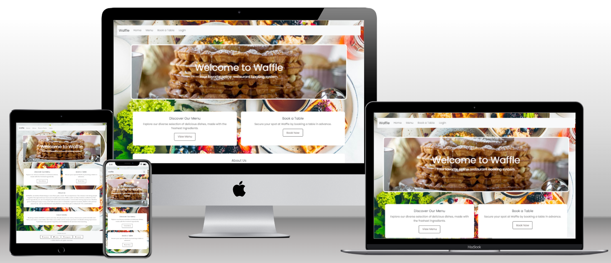
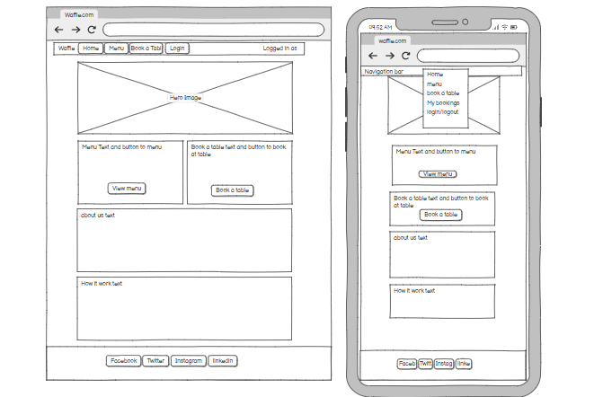
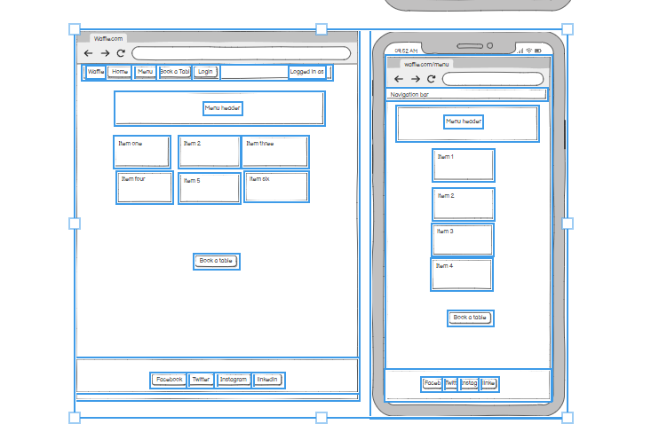
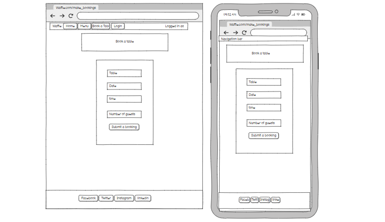
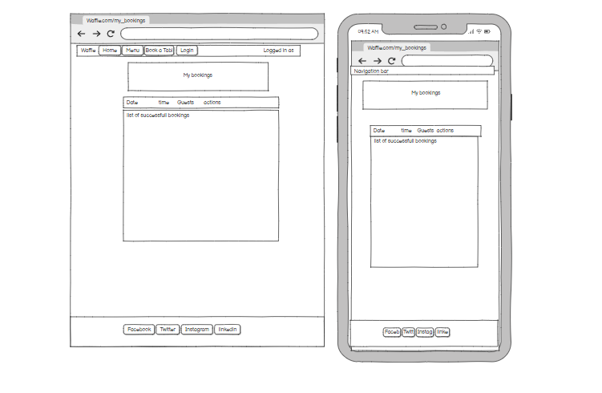
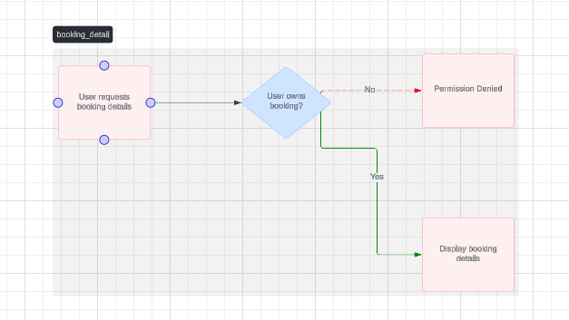
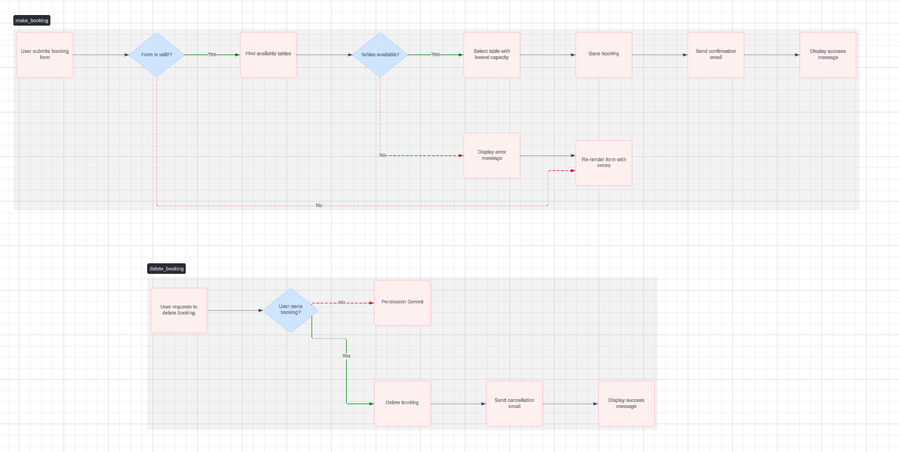
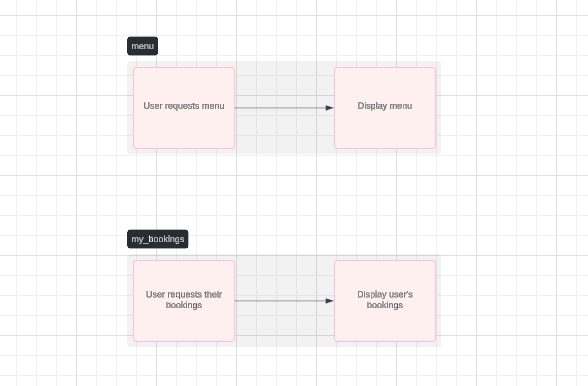
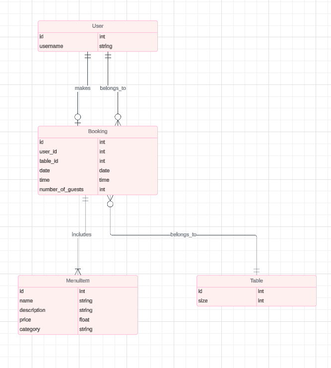

# Waffle

## Project description

This is a fictional waffle restaurant based in sweden and serving the best waffles in town.

[Live Site Link](https://oscarwaffle-be7490c12beb.herokuapp.com/)



## Table of Contents

- [Waffle](#project-name)
  - [Table of Contents](#table-of-contents)
- [User Experience Design](#user-experience-design)
  - [The Strategy Plane](#the-strategy-plane)
    - [Site Goals](#site-goals)
    - [User Stories](#user-stories)
    - [Agile Planning (Optional)](#agile-planning-optional)
  - [The Scope Plane](#the-scope-plane)
  - [The Structure Plane](#the-structure-plane)
    - [Features](#features)
    - [Features Left to Implement (Optional)](#features-left-to-implement-optional)
  - [The Skeleton Plane](#the-skeleton-plane)
    - [Wireframes](#wireframes)
    - [Database Design](#database-design)
    - [Security](#security)
  - [The Surface Plane](#the-surface-plane)
    - [Design](#design)
    - [Color Scheme](#color-scheme)
    - [Typography](#typography)
    - [Imagery](#imagery)
- [Technologies](#technologies)
- [Testing](#testing)
- [Deployment](#deployment)
  - [Version Control](#version-control)
  - [Deployment Instructions](#deployment-instructions)
  - [Run Locally](#run-locally)
  - [Forking the Project](#forking-the-project)
- [Credits](#credits)

## User Experience Design

## The Strategy Plane

### Site Goals

- The sites goal is to satisfy a need for waffels in an easy way to view menu and to book a table.

### User Stories

#### User Story 1: View Menu

- **As a** customer,
- **I want to** view the restaurant menu,
- **So that I can** see the dishes available for booking.

#### User Story 2: Book a Table

- **As a** customer,
- **I want to** book a table for a specific date and time,
- **So that I can** secure a spot at the restaurant.

#### User Story 3: Manage Menu

- **As an** admin,
- **I want to** add, edit, or remove menu items,
- **So that I can** keep the menu up to date.

#### User Story 4: Manage Tables

- **As an** admin,
- **I want to** add, edit, or remove tables,
- **So that I can** ensure the system accurately reflects available seating.

#### User Story 5: View Bookings

- **As an** admin,
- **I want to** view all customer bookings,
- **So that I can** manage reservations and ensure table availability.

#### User Story 6: Cancel a Booking

- **As a** customer,
- **I want to** cancel my existing booking,
- **So that I can** free up the table if my plans change.

#### User Story 7: View Booking Details

- **As an** admin,
- **I want to** view detailed information for each booking,
- **So that I can** manage reservations more effectively.

#### User Story 8: Manage User Accounts

- **As an** admin,
- **I want to** manage user accounts,
- **So that I can** handle user-related issues and maintain the system.

### Agile Planning (Optional)

### Booking System

This encompasses:
-**User Story 2**: Book a Table

- **User Story 6**: Cancel a Booking

These stories involve:
-Complex interactions with the database

- Table availability checks
- Potentially payment processing (not explicitly mentioned)

### Admin Management

This could include:
-**User Story 3**: Manage Menu
-**User Story 4**: Manage Tables
-**User Story 5**: View Bookings
-**User Story 7**: View Booking Details
-**User Story 8**: Manage User Accounts

These stories involve:
-Backend functionality for administrators to control various aspects of the restaurant's operations and user data

### Why These are Epics

- **Complexity**: They involve multiple interconnected features and functionalities, likely requiring more development effort than a single user story.
- **Scope**: They represent broader user goals rather than specific, isolated actions.

## The Scope Plane

- A homepage that welcomes the customer and throws information about the restaurant on them
- A menu for customers to view even if they are logged out.
- An easy to use booking form.
- An easy way to manage your bookings, edit and delete.

## The Structure Plane

### Features

- [For each major feature, provide a detailed explanation of its implementation, including relevant code snippets or screenshots. You can follow the "User Story - Implementation" format from the example.]

### Features Left to Implement (Optional)

- Newsletter subscription, add a map to location, contact page for queries. User management, reports for booking/deleted bookings

## The Skeleton Plane

### Wireframes

- 

- 

- 

- 

### Database Design

- 

- 

- 

- 

## Security

### 1. **Authentication (`@login_required`)**

- **Description**: The `@login_required` decorator is used to ensure only authenticated users can access certain views (e.g., making, editing, and deleting bookings).
- **Purpose**: Protects sensitive user actions and data from unauthorized users by redirecting them to the login page if they are not authenticated.

### 2. **Permission Checks**

- **Description**: Checks are implemented to verify that users can only interact with bookings they own, such as:

  ```python

     if booking.user != request.user:
         raise PermissionDenied()
     ```

- **Purpose**: Prevents users from accessing or modifying other users' bookings, safeguarding personal and booking information.

### 3. **Form Validation (`form.is_valid()`)**

- **Description**: Form data is validated to ensure that input is correct and follows expected formats.
- **Purpose**: Prevents malicious or invalid data from being submitted, mitigating risks like form tampering or injection attacks.

### 4. **Error Handling (`try...except`)**

- **Description**: Error handling mechanisms using `try...except` blocks ensure that any unexpected issues (e.g., database failures) are caught and handled gracefully.
- **Purpose**: Prevents system crashes and provides user-friendly error messages when something goes wrong, protecting system stability.

### 5. **Email Confirmation**

- **Description**: After a booking action is performed (creation, update, deletion), a confirmation email is sent to the user.
- **Purpose**: Provides an additional layer of verification, allowing users to monitor their bookings and take action if something suspicious occurs.

### 6. **Database Access Protection (`get_object_or_404`)**

- **Description**: The use of `get_object_or_404()` ensures that the requested booking or other database object exists before proceeding with the action.
- **Purpose**: Prevents users from accessing non-existent or deleted objects, protecting the application from errors and unauthorized access.

### 7. **Input Filtering for Availability (`Table.objects.filter()`)**

- **Description**: Queries are used to filter tables by capacity and availability, ensuring that only valid tables are assigned to a booking.
- **Purpose**: Prevents overbooking or the assignment of tables that are already reserved.

### 8. **Redirection After Actions**

- **Description**: After performing actions like booking creation or deletion, the user is redirected to the appropriate page (e.g., `my_bookings`).
- **Purpose**: Protects against form resubmission attacks, preventing duplicate bookings or accidental repetitions of actions.

## The Surface Plane

### Design

- **Overview**: The design of this webpage prioritizes a clean and inviting aesthetic to enhance user experience. High-quality food imagery is used to create visual appeal and highlight the restaurant's focus on delicious cuisine. A clear layout with distinct sections ensures easy navigation and access to information. Prominently displayed call-to-action buttons encourage users to explore the menu and book a table.

### Color Scheme

- **Primary Colors**:
  - **Off-white**: `#f5f5f5` - Used for the background, providing a neutral backdrop that lets the content and images stand out.
  - **Dark Green**: `#336633` - Used for text and accents, conveying a sense of freshness and sophistication associated with quality food.
  - **Orange**: `#ffa500` - Used for call-to-action buttons, drawing attention and creating a sense of urgency.

### Typography

- HTML
  - The structure of the Website was developed using HTML as the main language.
- CSS
  - The Website was styled using custom CSS in an external file.
- Python
  - Python was the main programming language used for the application using the Django Framework.
- Visual Studio Code
  - The website was developed using Visual Studio Code IDE
- GitHub
  - Source code is hosted on GitHub
- Git
  - Used to commit and push code during the development of the Website
- Font Awesome
  - This was used for various icons throughout the site
- Favicon.io
  - favicon files were created at https://favicon.io/favicon-converter/
- balsamiq
  - wireframes were created using balsamiq from https://balsamiq.com/wireframes/desktop/#

## Python Modules Used

- Django Class based views (ListView, UpdateView, DeleteView, CreateView) - Used for the classes to create, read, update and delete
- Mixins (LoginRequiredMixin, UserPassesTestMixin) - Used to enforce login required on views and test user is authorized to perform actions
- messages - Used to pass messages to the toasts to display feedback to the user upon actions
- timedelta, date - Date was used in order to search for objects by date and timedelta for searching date ranges

## External Python Modules

- asgiref==3.8.1 - ASGI server reference, used by Django for async capabilities
- crispy-bootstrap5==2024.2 - Allows Bootstrap 5 usage with crispy forms
- dj-database-url==2.2.0 - Parses database URL for the production environment
- Django==5.1 - Framework used to build the application
- django-allauth==64.2.0 - Authentication system for sign-up, sign-in, logout, password resets, etc.
- django-crispy-forms==2.3 - Styles forms upon rendering
- django-extensions==3.2.3 - Collection of custom extensions for Django
- gunicorn==23.0.0 - WSGI HTTP server for UNIX used to serve the Django application
- packaging==24.1 - Version and dependency management
- psycopg2==2.9.9 - PostgreSQL adapter used for Heroku deployment
- sqlparse==0.5.1 - SQL query parsing tool used in Django
- typing_extensions==4.12.2 - Provides backported typing features
- tzdata==2024.1 - Time zone database used with Django
- whitenoise==6.7.0 - Serves static files without a cloud provider (e.g., Cloudinary)

### Imagery

- [Describe any images or graphics used and their sources (if applicable).]

## Technologies

- [List all the technologies, languages, frameworks, and libraries used in your project.]
- [You can include Python modules and external libraries as in the example.]

## Testing

Test cases and results can be found in the [TESTING.md](TESTING.md) file. This was moved due to the size of the file.

## Deployment

### Version Control

The site was created using the Visual Studio Code editor and pushed to github to the remote repository.

The following git commands were used throughout development to push code to the remote repo:

```git add <file>``` - This command was used to add the file(s) to the staging area before they are committed.

```git commit -m “commit message”``` - This command was used to commit changes to the local repository queue ready for the final step.

```git push``` - This command was used to push all committed code to the remote repository on github.

### Deployment Instructions

### Heroku Deployment

The site was deployed to Heroku. The steps to deploy are as follows:

- Navigate to heroku and create an account
- Click the new button in the top right corner
- Select create new app
- Enter app name
- Select region and click create app
- Click the resources tab and search for Heroku Postgres
- Select hobby dev and continue
- Go to the settings tab and then click reveal config vars
- Add the following config vars:
  - SECRET_KEY: (Your secret key)
  - DATABASE_URL: (This should already exist with add on of postgres)
  - EMAIL_HOST_USER: (email address)
  - EMAIL_HOST_PASS: (email app password)
- Click the deploy tab
- Scroll down to Connect to GitHub and sign in / authorize when prompted
- In the search box, find the repositoy you want to deploy and click connect
- Scroll down to Manual deploy and choose the main branch
- Click deploy

### Run Locally

Navigate to the GitHub Repository you want to clone to use locally:

- Click on the code drop down button
- Click on HTTPS
- Copy the repository link to the clipboard
- Open your IDE of choice (git must be installed for the next steps)
- Type git clone copied-git-url into the IDE terminal

The project will now have been cloned on your local machine for use.

### Forking the Project

Most commonly, forks are used to either propose changes to someone else's project or to use someone else's project as a starting point for your own idea.

- Navigate to the GitHub Repository you want to fork.

- On the top right of the page under the header, click the fork button.

- This will create a duplicate of the full project in your GitHub Repository.

## Credits

- Daisy McGirr for being my mentor.
- Gareth McGirr SizzleAndSteak project inspiration and readme inspiration.
- Jonathan Zakrisson for debugging and tips.
- Google why not?.
- Josefine Bäckman my wife.
- Family for testing and input.
