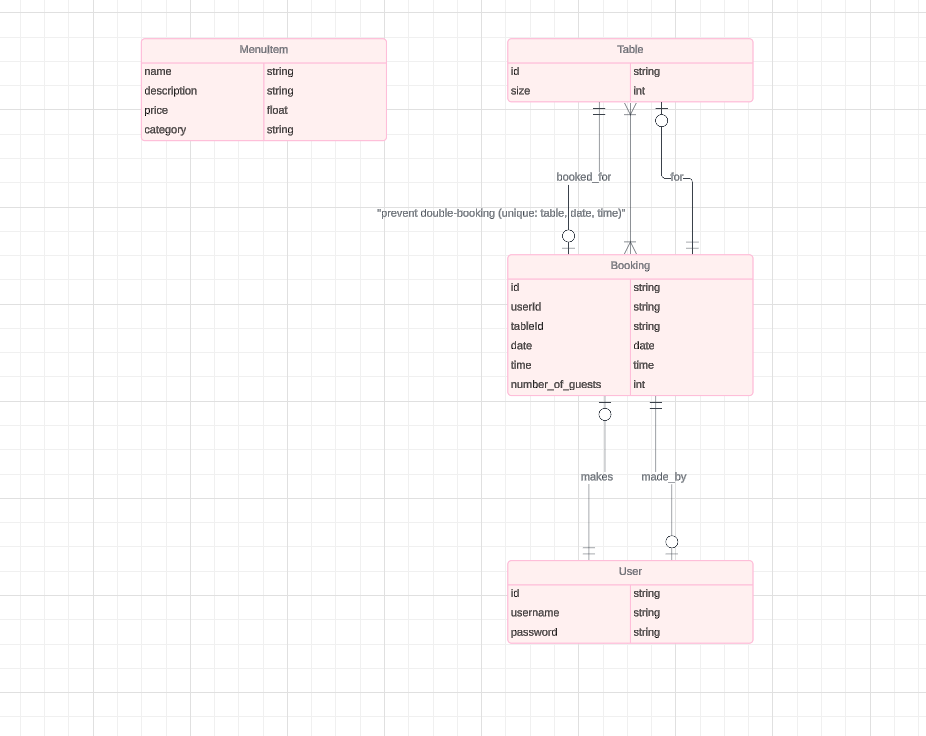

# Waffle

## Project description

This is a fictional waffle restaurant based in sweden and serving the best waffles in town.

[Live Site Link](https://oscarwaffle-be7490c12beb.herokuapp.com/) 


## Table of Contents

- [Waffle](#project-name)
  - [Table of Contents](#table-of-contents)
- [User Experience Design](#user-experience-design)
  - [The Strategy Plane](#the-strategy-plane)
    - [Site Goals](#site-goals)
    - [User Stories](#user-stories) 
    - [Agile Planning (Optional)](#agile-planning-optional)
  - [The Scope Plane](#the-scope-plane)
  - [The Structure Plane](#the-structure-plane)
    - [Features](#features)
    - [Features Left to Implement (Optional)](#features-left-to-implement-optional)
  - [The Skeleton Plane](#the-skeleton-plane)
    - [Wireframes](#wireframes)
    - [Database Design](#database-design)
    - [Security](#security)
  - [The Surface Plane](#the-surface-plane)
    - [Design](#design)
    - [Color Scheme](#color-scheme)
    - [Typography](#typography)
    - [Imagery](#imagery)
- [Technologies](#technologies)
- [Testing](#testing)
- [Deployment](#deployment)
  - [Version Control](#version-control)
  - [Deployment Instructions](#deployment-instructions)
  - [Run Locally](#run-locally)
  - [Forking the Project](#forking-the-project)
- [Credits](#credits)


# User Experience Design 

## The Strategy Plane

### Site Goals

* [Clearly list the primary goals your project aims to achieve. What problems does it solve? What value does it provide to users?]

### User Stories

* [List out the key user stories that drove the development of your project. Focus on the "who", "what", and "why" of each story.] 

### Agile Planning (Optional)

* [If you used Agile methodologies, briefly describe your process, sprints, epics, etc.]

## The Scope Plane

* [List the core features and functionalities included in your project.]

## The Structure Plane

### Features

* [For each major feature, provide a detailed explanation of its implementation, including relevant code snippets or screenshots. You can follow the "User Story - Implementation" format from the example.]

### Features Left to Implement (Optional)

* [If applicable, list features you'd like to add in the future]

## The Skeleton Plane

### Wireframes

* 

* 

* 

* 

### Database Design

* 

* 

* 
* 

### Security

* [Explain the security measures you've implemented to protect user data and prevent unauthorized access.]

## The Surface Plane

### Design

* [Provide a brief overview of your design approach and philosophy.]

### Color Scheme

* [List the primary colors used and their hex codes.]

### Typography

* [Specify the fonts used for headings, body text, etc.]

### Imagery

* [Describe any images or graphics used and their sources (if applicable).]

# Technologies

* [List all the technologies, languages, frameworks, and libraries used in your project.]
* [You can include Python modules and external libraries as in the example.]

# Testing

* [Detail your testing process, including types of tests conducted, tools used, and any notable findings or challenges.]
* [Consider linking to a separate TESTING.md file if your testing documentation is extensive] 

# Deployment

### Version Control

The site was created using the Visual Studio Code editor and pushed to github to the remote repository 

The following git commands were used throughout development to push code to the remote repo:

```git add <file>``` - This command was used to add the file(s) to the staging area before they are committed.

```git commit -m “commit message”``` - This command was used to commit changes to the local repository queue ready for the final step.

```git push``` - This command was used to push all committed code to the remote repository on github.


### Deployment Instructions

### Heroku Deployment

The site was deployed to Heroku. The steps to deploy are as follows:

- Navigate to heroku and create an account
- Click the new button in the top right corner
- Select create new app
- Enter app name
- Select region and click create app
- Click the resources tab and search for Heroku Postgres
- Select hobby dev and continue
- Go to the settings tab and then click reveal config vars
- Add the following config vars:
  - SECRET_KEY: (Your secret key)
  - DATABASE_URL: (This should already exist with add on of postgres)
  - EMAIL_HOST_USER: (email address)
  - EMAIL_HOST_PASS: (email app password)
- Click the deploy tab
- Scroll down to Connect to GitHub and sign in / authorize when prompted
- In the search box, find the repositoy you want to deploy and click connect
- Scroll down to Manual deploy and choose the main branch
- Click deploy

### Run Locally

* [Explain how to set up and run your project on a local development environment.]

### Forking the Project

* [Give instructions on how others can fork your project on GitHub.]

# Credits

* [Acknowledge any external resources, libraries, tutorials, or individuals that contributed to your project.] 
* [Be sure to include image attributions if you used any.]